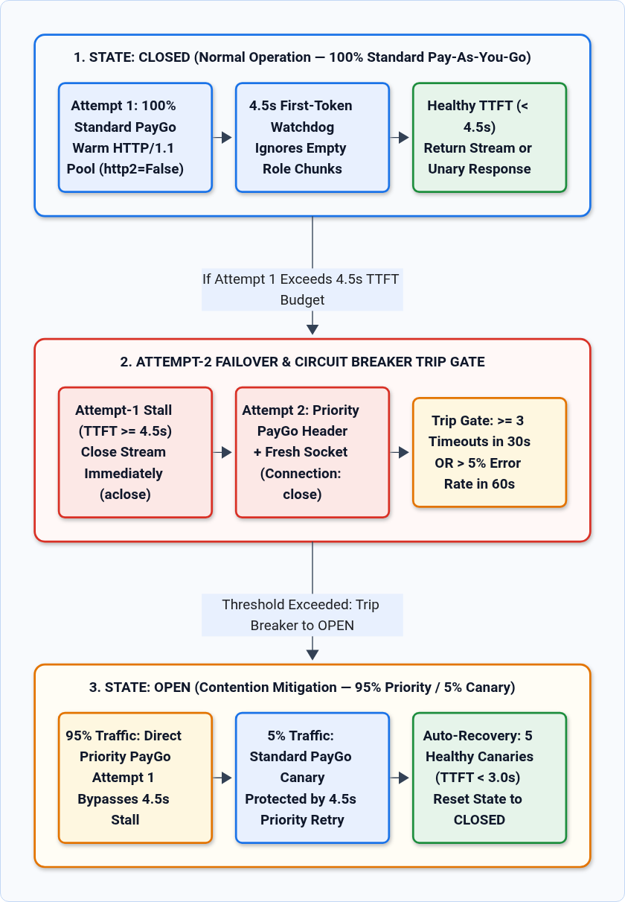
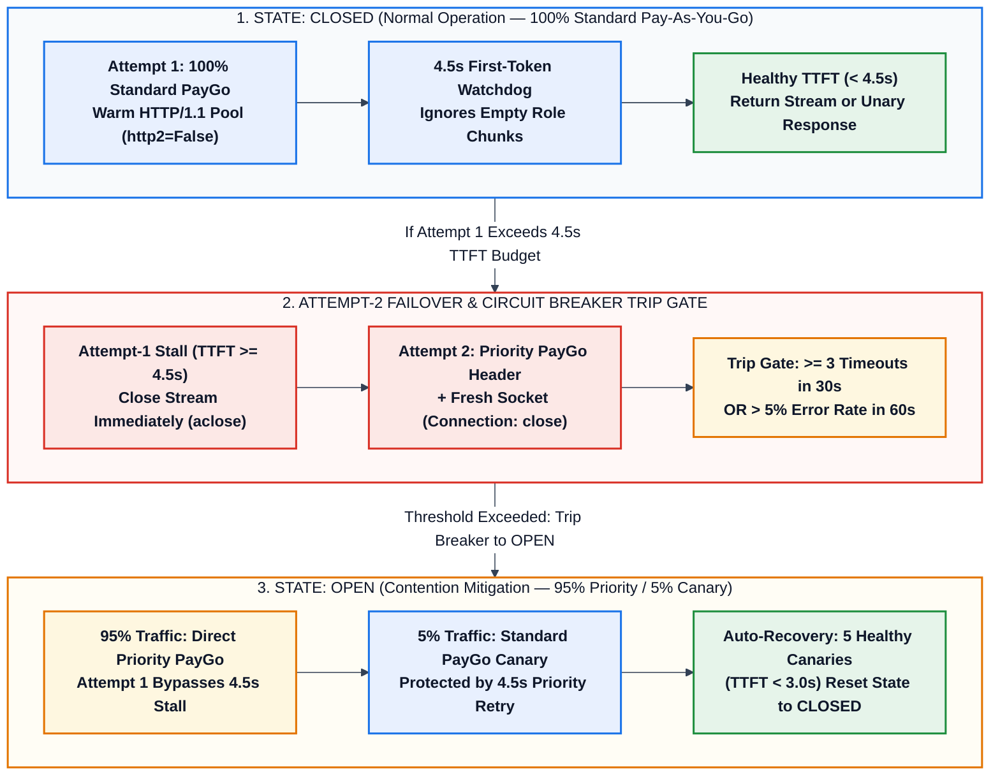

# Vertex AI Resilient Transport & Adaptive Priority Pay-As-You-Go Wrapper for LiteLLM

Production-ready, asynchronous Python reference implementation (`vertex_resilient_acompletion.py`) wrapping [`litellm.acompletion`](https://docs.litellm.ai/docs/providers/vertex) for latency-sensitive, real-time Google Cloud Vertex AI workloads (`vertex_ai/gemini-3.8-flash` and `vertex_ai/gemini-3.5-flash-lite`), such as voice agents, real-time contact center assistants, and interactive streaming pipelines.

---

## Architecture & Core Capabilities

Real-time voice and interactive applications operating under strict end-to-end latency budgets (for example, a `15–30s` gateway timeout with `8,000–13,000` input tokens) require deterministic protection against transient regional prefill queuing and sticky HTTP connection stalls.

`VertexResilientClient` and `VertexPriorityCircuitBreaker` implement a **5-Layer Transport & Quota Resilience Architecture** using 100% standard open-source libraries (`litellm` and `httpx`):

1. **Layer 1 — Transparent Streaming Enforcement (`stream=True`) & Unary Reassembly (`litellm.stream_chunk_builder`)**:
   - Even when callers request a standard non-streaming response (`stream=False`), the wrapper executes `:streamGenerateContent` (`stream=True`) on the wire so it can measure exact **Time-To-First-Token (TTFT)** separately from total generation time, then reassembles the chunks transparently into a standard `litellm.ModelResponse`.
2. **Layer 2 — Payload-Verified TTFT Watchdog (`4.5s`) & Async Generator Cleanup (`await stream.aclose()`)**:
   - Inspects incoming streaming chunks via `_chunk_has_payload(chunk)` and ignores empty initial metadata/role frames (`role="assistant"`, `content=""`), stopping the TTFT timer only when the first real content token, reasoning thought token, or tool-call delta arrives.
   - If the first non-empty token does not arrive within `ttft_timeout` (`4.5s` default for generation, `2.5s` for guardrails), the wrapper explicitly closes the underlying async generator (`await response_stream.aclose()`) to prevent socket leaks and immediately fails over.
3. **Layer 3 — Dual-Pool `httpx.AsyncClient` (`http2=False` + `Connection: close` Socket Recycling)**:
   - Maintains two isolated `httpx.AsyncClient` pools:
     - `warm_client`: `http2=False` (HTTP/1.1 eliminates head-of-line stream blocking across multiplexed calls), `max_keepalive_connections=20`, `keepalive_expiry=30.0s` for healthy Attempt-1 traffic.
     - `ephemeral_client`: `http2=False`, `max_keepalive_connections=0`, `keepalive_expiry=0.0s` + `extra_headers={"Connection": "close"}` for Attempt-2 failover retries, guaranteeing a fresh TCP/TLS handshake to an un-congested Google Front End (GFE).
4. **Layer 4 — 3-State Adaptive Standard $\leftrightarrow$ Priority Pay-As-You-Go Circuit Breaker (`95% Priority / 5% Standard Canary`)**:
   - **`CLOSED` (Normal — `100%` Standard PayGo)**: All Attempt-1 calls use Standard Pay-As-You-Go. Any single call exceeding the `4.5s` TTFT budget fails over on Attempt 2 to **Priority Pay-As-You-Go** (`extra_headers={"X-Vertex-AI-LLM-Shared-Request-Type": "priority"}`) on an ephemeral socket.
   - **`OPEN` (Contention Detected — `95%` Priority / `5%` Standard Canary)**: Trips automatically when `>= 3` Standard TTFT stalls occur within 30 seconds or when the rolling 60-second failure rate exceeds `5%`. Routes `95%` of traffic directly to Priority Pay-As-You-Go on Attempt 1 (eliminating the `4.5s` wait penalty) while sending `5%` as **Standard Pay-As-You-Go Canary Probes** (still protected by the `4.5s` Attempt-2 Priority fallback so canary requests never fail).
   - **Auto-Recovery (`OPEN` $\to$ `CLOSED`)**: Once `5` consecutive Standard Canary Probes succeed with `TTFT < 3.0s`, the circuit breaker automatically resets to `CLOSED` (`100%` Standard Pay-As-You-Go).
5. **Layer 5 — High-Throughput Guardrail Tiering (`gemini-3.5-flash-lite`) & Context Caching (`cached_content`)**:
   - Provides `acompletion_guardrail()` pre-configured for `vertex_ai/gemini-3.5-flash-lite` with a `2.5s` TTFT budget to offload pre-call/post-call classifiers and safety checks from the primary `vertex_ai/gemini-3.8-flash` pool.
   - Natively forwards `cached_content` resource IDs to bypass repeated prefill computation on large static system prompts (`8,000–13,000` tokens).

---

## State Machine & Request Lifecycle



<details>
<summary>View Editable Mermaid Source</summary>



</details>

---

## Installation

```bash
pip install -r requirements.txt
```

---

## Quickstart Usage

```python
import asyncio
from vertex_resilient_acompletion import VertexResilientClient

# Initialize a process-wide singleton client at application startup
vertex_client = VertexResilientClient(
    default_model="vertex_ai/gemini-3.8-flash",
    guardrail_model="vertex_ai/gemini-3.5-flash-lite",
    primary_location="global",
    fallback_location="europe-west4",
    ttft_timeout=4.5,               # 4.5s non-empty first-token watchdog
    guardrail_ttft_timeout=2.5,     # 2.5s watchdog for guardrail checks
    stream_completion_timeout=25.0, # Comfortably inside a 30s voice gateway SLA
)


async def handle_voice_turn(user_utterance: str, cached_prompt_id: str | None = None):
    # 1. Fast Guardrail / Intent Check on gemini-3.5-flash-lite
    guard_resp = await vertex_client.acompletion_guardrail(
        messages=[{"role": "user", "content": user_utterance}],
        stream=False,
    )

    # 2. Main Voicebot Response on gemini-3.8-flash
    #    Automatically uses Standard PayGo when healthy, fails over in 4.5s to
    #    Priority PayGo on fresh TCP/TLS sockets, and shifts to 95% Priority /
    #    5% Standard Canary during contention windows.
    response = await vertex_client.acompletion(
        messages=[{"role": "user", "content": user_utterance}],
        stream=False,  # Returns standard litellm.ModelResponse (or True for async stream)
        cached_content=cached_prompt_id,
    )
    return guard_resp.choices[0].message.content, response.choices[0].message.content
```

---

## Running the Built-In Unit Test Suite

`vertex_resilient_acompletion.py` includes a self-contained `unittest.IsolatedAsyncioTestCase` verification suite covering all 5 resilience layers without requiring live cloud credentials:

```bash
python3 tests/test_unit_resilient_client.py
# Or directly via:
python3 vertex_resilient_acompletion.py
```

Expected output:

```text
test_01_closed_state_routes_standard_and_builds_unary_response ... ok
test_02_empty_initial_chunk_trap_triggers_priority_failover ... ok
test_03_circuit_breaker_trips_and_splits_95_5_canary ... ok
test_04_canary_auto_recovery_closes_breaker ... ok
test_05_guardrail_helper_uses_flash_lite_and_tight_budget ... ok

----------------------------------------------------------------------
Ran 5 tests in 0.343s

OK
```

---

## Running the Live Vertex AI End-to-End Integration Test Suite

`tests/test_live_vertex_e2e.py` executes 5 live end-to-end tests against Google Cloud Vertex AI (`vertex_ai/gemini-3.8-flash` and `vertex_ai/gemini-3.5-flash-lite`), verifying unary reassembly, streaming TTFT telemetry, guardrail routing, forced Attempt-1 TTFT timeout failover to Priority Pay-As-You-Go (`X-Vertex-AI-LLM-Shared-Request-Type: priority` + ephemeral `Connection: close` socket), and `OPEN -> CLOSED` canary auto-recovery:

```bash
export VERTEX_PROJECT="your-gcp-project-id"
python3 tests/test_live_vertex_e2e.py
```

---

## Official Google Cloud & Open-Source References

- [Vertex AI Priority Pay-As-You-Go Documentation](https://cloud.google.com/vertex-ai/generative-ai/docs/priority-pay-as-you-go)
- [Vertex AI Dynamic Shared Quota (DSQ)](https://cloud.google.com/vertex-ai/generative-ai/docs/dynamic-shared-quota)
- [Vertex AI Context Caching Overview](https://cloud.google.com/vertex-ai/generative-ai/docs/context-cache/context-cache-overview)
- [GoogleCloudPlatform/generative-ai — Priority Pay-As-You-Go Notebook](https://github.com/GoogleCloudPlatform/generative-ai/blob/main/gemini/getting-started/priority_paygo.ipynb)
- [LiteLLM Vertex AI Provider Reference](https://docs.litellm.ai/docs/providers/vertex)
